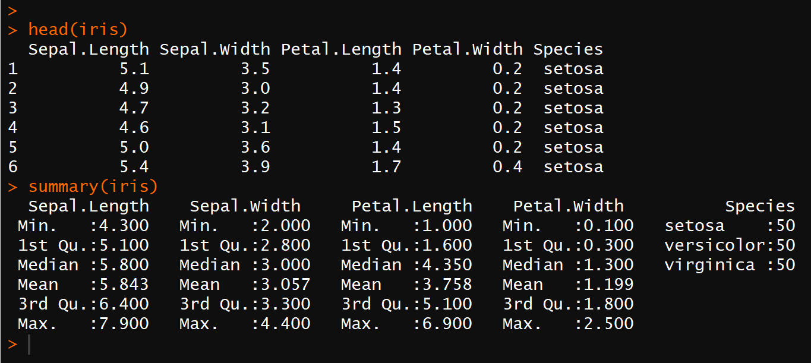

```{r setup, include=FALSE}
knitr::opts_chunk$set(echo = FALSE)
```

# What is R?
- R is a statistical programming language
    - Statistical analysis
    - Data visualization
    - Data mining
    - General programming

- It is open-source
    - Free as in “free beer” and “free speech”
    - Large active community around R
    - Many contributed packages


# Why do you need to know R?

- R is very powerful, and allows us to manually compute
everything we want if we choose to

- For many of the methods we use, R has either the simplest or
the only implementation.

- A main tool among Data scientists

# What do you need to know about R?

- In this course not much.
    - Tiny bits of programming
    - Cookbook method

    - Strongly advised to learn about R (or Python) for DS

# Let's get started

- First use of R and RStudio
    - We will use the environment RStudio for our work in R

- What is the difference?
    - R is the program interpreter. Does the job.
    - RStudio is a "front end" that makes it easier to use R.

- RStudio requires R.

# Meet RStudio!

- RStudio has 4 panels:

    - Console: This is the actual R window, you can enter commands here and execute them by pressing enter
    - Source: This is where we can edit scripts. It is where you do most of your work Control-enter sends selected codes to the console
    - Plots/Help: This is where plots and help pages will be shown
    - Workspace: Shows which objects you currently have
    - Anything following a # symbol is treated as a comment!## R Markdown

# R as calculator

- You can use R as a calculator


# In R, everything has a name

- Assign and use objects

    - The <- operator can be used to store values into objects
    - An object can contain anything in R
    - R expressions that are not stored in an object are printed

- Object names are...

    - Unique: If you use the same name, the old will be *overwritten*
    - Sensitive: MyData is *not the same* as mydata

# We can use R as a calculator


# Numeric and character data

- In R, there are several types of data:

    - Numeric: numbers of all kinds
    - Character: one of more text character (which may be a number!)
        - Multiple characters in a row = strings
    - Logical: TRUE or FALSE

# Numeric data


# Character data


# Assigning stuff to objects


# How does data get into R?

- Use *read.csv* or to read simple text files (or *data.table::fread*)

- Convert from other software (Excel, Stata, etc.) using *readxl* or *haven*

# Data frames (or tibbles)

- Data sets is represented as *data frames*

- R can deal with many data sets at once
    - Data frames stored under different names
    - Stata/SPSS: One data set at the time

- For our purposes: 
    - Summarize one data set using regression (old data, "training data")
    - Predict on *another data set* (new data, "testing data")

# Looking at a data frame



# More info about R for Data science

- Enormous amount of material on internet

- Look e.g. at this free book: http://r4ds.had.co.nz/

- New relevant books:
    - Kosuke Imai: **Quantitative data analysis**
    - Kieran Healy: **Data visualization for the social sciences**
    

# Nano data science!

- Let us do something REAL!

    - Load data set, and store it in an object
    - Look at data set
    - Summarize data set
    - Model data using linear regression
    - Predict from model using same data
    - Evaluate prediction
    - Model again, but better
